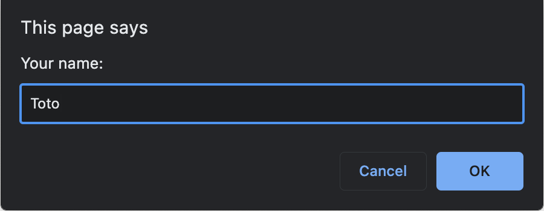
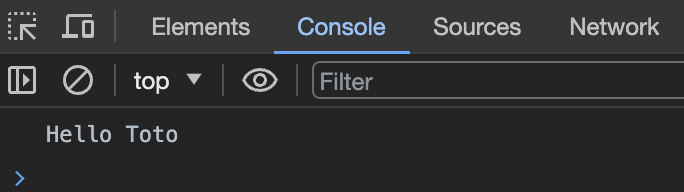
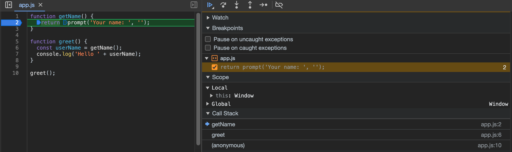

# Call stack basics

This is a simple example that displays an empty page with a prompt to enter a name.

```javascript
function getName() {
  return prompt('Your name: ', '');
}

function greet() {
  const userName = getName();
  console.log('Hello ' + userName);
}

greet();
```

As can be seen above, the `greet` function calls the `getName` function which in turn calls the `prompt` function. It displays a prompt to the user and returns the value entered by the user. To see the result of this basic example, you will need to open the developer tools of your browser and go to the console tab. You will see the following:





If we place a breakpoint in the `getName` function, we can see the call stack via the Sources tab of the developer tools:



The call stack shows in which order the functions were called. The last function that was called, `getName` is the first function that will be executed. 